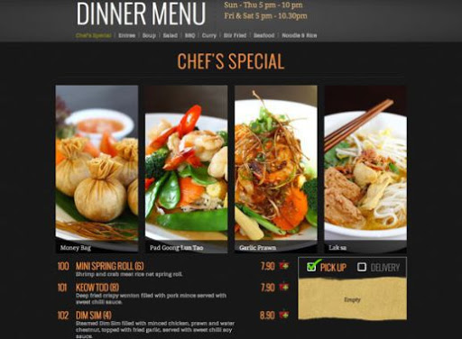

<h3 align="center">
  Desafio 4: Crie uma aplicação web que consuma a API criada no Projeto-03.
</h3>

<blockquote align="center">
"A luta termina quando a gratidão começa." 
  
Neale Donald Walsch

</blockquote>

  
  

  

  

## :computer:Sobre o desafio

## Objetivo:

Criar uma aplicação web que irá consumir a API construída no Projeto-03. Essa versão WEB terá apenas a visão do RESTAURANTE, na qual gerenciará os pedidos, pratos, etc.

### Requisitos:
- Responsividade em tablet, notebook e desktop;
- Validação de Login/Senha;
- Código limpo e comentado sāo requisitos do desafio.

### Conhecimento em:

Qualquer linguagem ou framework front-end.

## :pencil2: Telas e Layout

  

- Login;
- Dashboard;
- Account;
- Orders;
- Food Items;
- Post new item;
- Edit item;

Clique para ver o <a href="https://www.figma.com/file/AvXI31ym3P18VY0PFVaVuL/Apollo-Food-WEB?node-id=1%3A4956" target="_blank" rel="noopener noreferrer">
Layout
</a> no Figma e utilizar os componentes dos Layout.

## :tada: Entrega

Copie a URL do repositório com o desafio e envie pela plataforma: https://platform.apollopartners.com.br/

## :question: Dúvidas

Acesse o <a href="https://github.com/Apollo-Group/Projeto-FAQ">
FAQ
</a> ou abra uma issue nesse repositório que retornamos em breve.

## :clipboard: Licença

Esse projeto está sob a licença MIT. Veja o arquivo [LICENSE](LICENSE) para mais detalhes.

---

